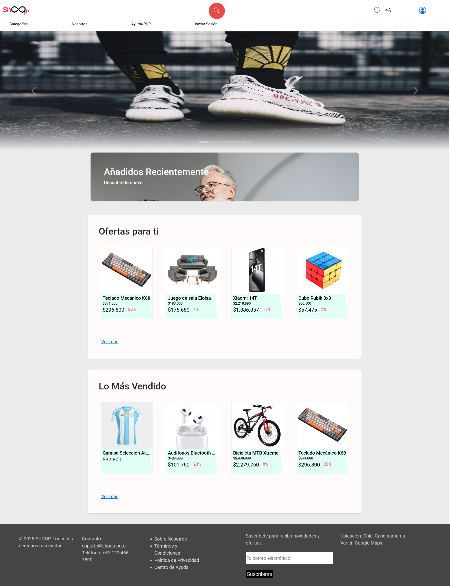
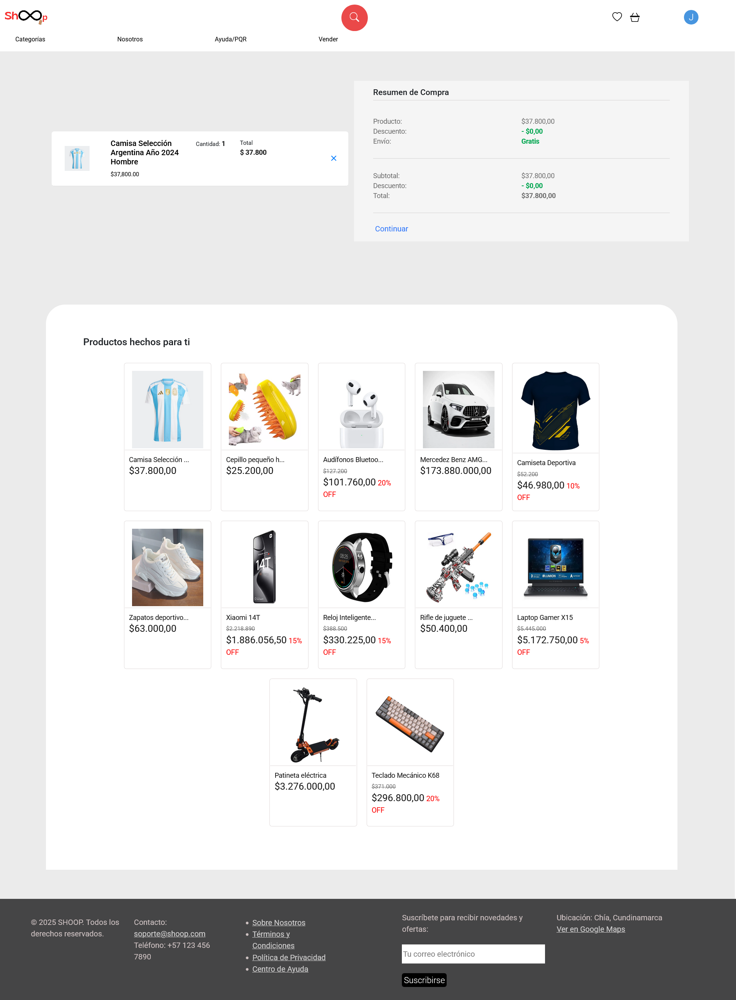
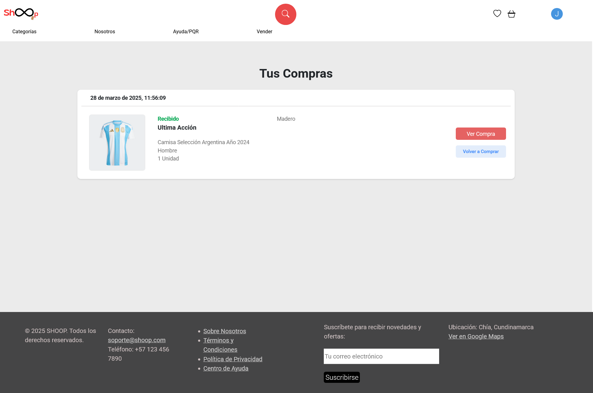
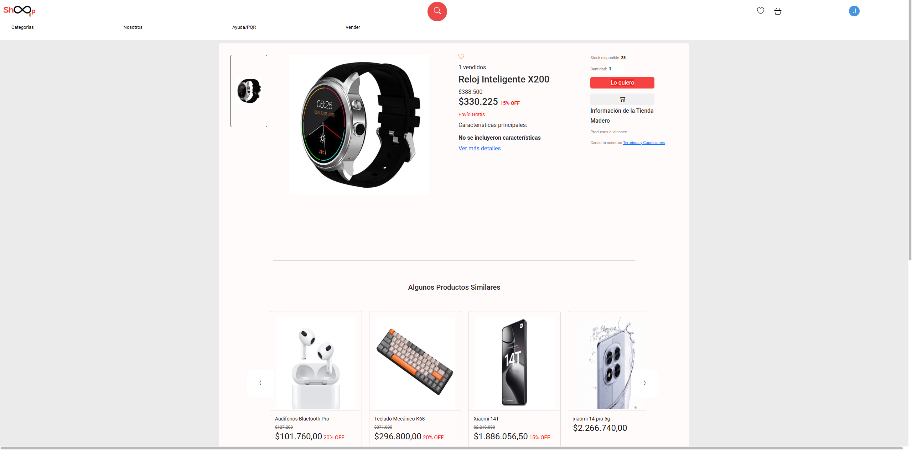
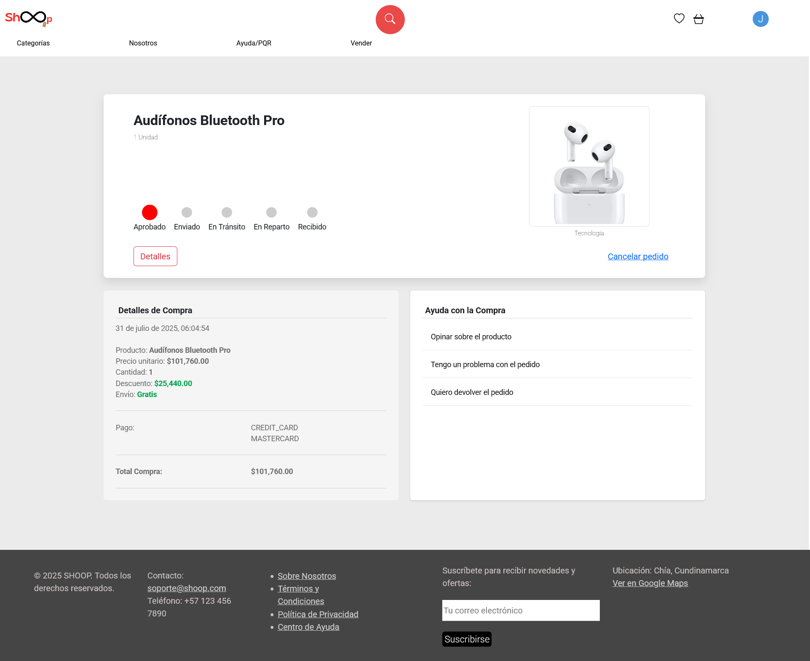

# 🛒 Shoop - Tienda Online para Comercio Local

🌐 [Ver sitio en línea](https://shoop.ct.ws/)
- 👉 Navegador Recomendado: Chrome


Shoop es un ecommerce desarrollado como **proyecto de formación en el SENA** con el objetivo de impulsar el **comercio local**. Fue creado para conectar clientes y vendedores, permitir la compra online de productos de pequeños negocios y fortalecer así la economía de las comunidades.

## 🎯 Objetivo
Facilitar una plataforma web que permita a los vendedores locales:
- Publicar sus productos
- Recibir pedidos en línea
- Ampliar su alcance más allá del entorno físico

Y a los clientes:
- Explorar un catálogo de productos
- Comprar desde casa
- Recibir facturas y confirmar pagos online

---

## 👨‍💻 Rol y equipo

Este proyecto fue desarrollado como parte del proceso de formación en el Centro de Desarrollo Agroempresarial por el equipo:

- David Soriano – Desarrollador principal (frontend y backend, integración PayU, lógica de negocio)
- Dariana Marcela De la Cruz – Apoyo en documentación, pruebas y base de datos
- Kevin Jhohan Galindo – Apoyo en pruebas, revisión y desarrollo de código, base de datos
- Thomas Andres Bello – Colaboración en diseño de formularios y estructura
- Deivid Alejandro Ruiz -  Apoyo en documentación y pruebas
  
Yo, **David Soriano**, me encargué de la mayor parte del **desarrollo frontend y backend**, incluyendo:

- Maquetación completa en HTML y CSS
- Lógica de carrito, facturación, y conexión con base de datos
- Integración con pasarela de pagos PayU (modo pruebas)
- Envío automático de correos
- Estructura y funcionalidad general del sitio

El equipo colaboró principalmente en:
- Documentación del proyecto
- Diseño del modelo de base de datos
- Apoyo en ciertas funciones y pruebas

---

## 🛠 Tecnologías utilizadas

- HTML5, CSS3
- JavaScript (vanilla)
- PHP
- MySQL
- PayU (modo sandbox)
- SMTP para envío de correos
- Bootstrap
- TCPDF
- Highchar
- Composer
- JQuery

---

## 🔄️ Metodologías de desarrollo

- SCRUM
- RUP

---

## ✅ Funcionalidades

- Registro e inicio de sesión de clientes
- Catálogo dinámico de productos
- Carrito de compras
- Favoritos
- Proceso de compra completo
- Generación y envío de facturas
- Balances de compras
- Reportes de ventas
- Integración con PayU
- Base de datos relacional conectada por PHP

---

## 🚧 En desarrollo / pendientes

- Funcionalidad de mensajes cliente-vendedor
- Ajustes menores en paneles administrativos
- Optimización de tablas
- Validaciones adicionales en formularios internos
- Ayuda con la compra
- Correo de suscripción
- Términos y condiciones/Política de privacidad

---

## 📸 Capturas de pantalla

| Escritorio | Móvil |
|-----------|-------|
|  |  |

| Carrito | Compras |
|--------|---------|
|  |  |

| Info Producto | Envío |
|---------------|--------|
|  |  |


---

## 🤓 Notas de Funcionalidades
- 👉 Disponible en línea para pruebas funcionales.
- ⚠️ Versión de pruebas conectada a PayU sandbox. No se realizan pagos reales.
- 🌐 Navegador Recomendado: Chrome

## 📦 Instalación local (modo desarrollo)

Sigue estos pasos para ejecutar el proyecto Shoop en tu entorno local usando XAMPP o similar:

1. **Clona el repositorio**
   Abre tu terminal y ejecuta:
   ```bash
   git clone https://github.com/tuusuario/shoop.git

2. **Ubica el proyecto en la carpeta htdocs**
    Copia la carpeta del proyecto dentro de la ruta:
    ```bash
    C:\xampp\htdocs\
    ```
3. **Importa la base de datos**
   - Abre phpMyAdmin desde
     ```bash
     http://localhost/phpmyadmin
   - Crea una base de datos con el nombre del proyecto shoop
   - Importa el archivo shoop.sql que está en la carpeta /db del proyecto

4. **Configura la conexión a la base de datos**
    Abre el archivo datos.php en la carpeta model y ajusta según tu configuración local:
    ```bash
    $host = 'localhost';
    $user = 'root';
    $password = '';
    $db = 'shoop';
    ```

5. **Activa el servidor**
    Inicia Apache y MySQL desde el panel de control de XAMPP
    
    Abre tu navegador y accede a:
    ```bash
    http://localhost/shoop/
    ```

6. **Listo**
    Ya puedes navegar el sitio como cliente, registrar productos y probar el flujo de compra completo.

⚠️ Recuerda que la integración con PayU está en modo sandbox (pruebas). No se procesan pagos reales.

> ⚠️ **Importante**:  
> Para visualizar correctamente algunas funciones (como pasarela de pago o contenido externo), asegúrate de no tener bloqueadores de anuncios o extensiones similares activas en tu navegador.

> 📝 **Nota**:  
> El proyecto alojado en este repositorio puede diferir ligeramente en algunas funcionalidades, datos o productos respecto a la versión en línea. Esto se debe a mejoras continuas, pruebas y adaptaciones entre el entorno de desarrollo local y el entorno de producción.

## 📄 Licencia
- Proyecto académico sin fines comerciales.
- Desarrollado como parte del proceso formativo del SENA – 2023 / 2025
